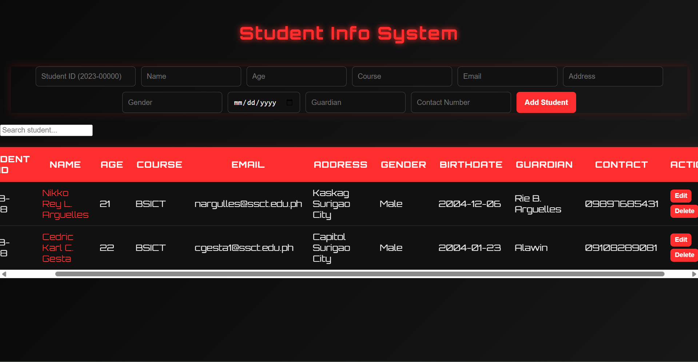
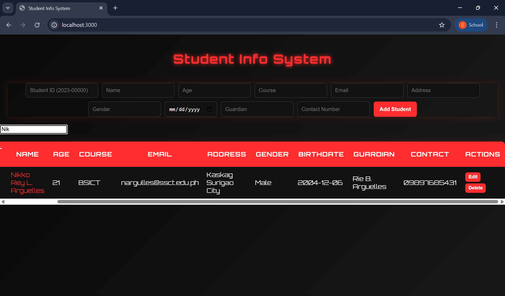
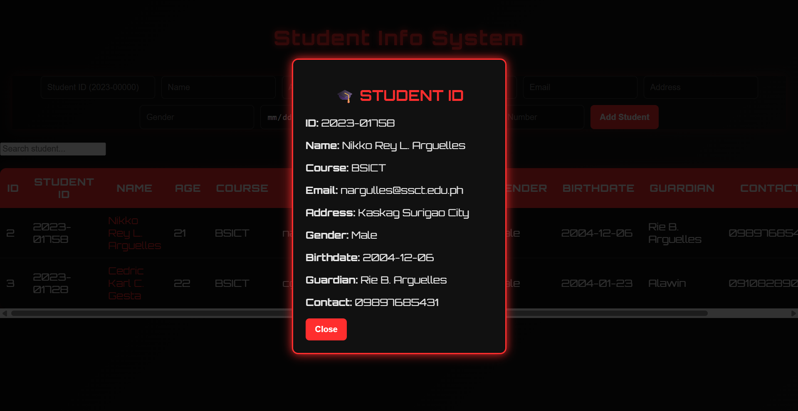

  

STUDENT-INFO-SYSTEM (NestJS + HTML/CSS/JS)

FEATURE 1: Student ID Card View
Mini Specs:

* When the user clicks the student’s name in the table, a detailed Student ID card should appear.
* The ID card displays complete student information including Student ID, Name, Course, Email, Address, Gender, Birthdate, Guardian, and Contact Number.

What I Implemented:

* Added a clickable student name in the table.
* Created a modal (popup) that shows the Student ID card.
* Used JavaScript to pass student data into the modal dynamically.
* Styled the ID card using a motorcycle-themed design (dark background with red accents).

Problems / Challenges Encountered:

* Passing full student data from table to modal using JSON caused formatting issues at first.
* Needed to ensure all fields are correctly displayed even if some are empty.
* Styling the modal to match the theme while keeping it readable was challenging.

FEATURE 2: Separate Edit Page for Full Student Information
Mini Specs:

* Instead of using a simple alert/prompt, editing a student should open a new page.
* The page should contain a form with all student fields and allow updating them.

What I Implemented:

* Replaced prompt-based editing with a dedicated edit page (edit.html).
* Created a full form with labeled inputs (Student ID, Name, Age, Course, Email, etc.).
* Used URL parameters to pass the selected student ID.
* Fetched existing student data and auto-filled the form.
* Connected the form to the backend using PUT request to update the student.
* Applied the same CSS design as the main page for consistency.

Problems / Challenges Encountered:

* Passing the student ID between pages required understanding URL parameters.
* Auto-filling form data needed proper API fetching and mapping.
* Ensuring all fields update correctly (not just name, age, course) required backend alignment.

ADDITIONAL NOTES:

* Also implemented a search bar for filtering students in real time.
* Adjusted table layout to handle many columns using horizontal scrolling.
* Fixed backend error for large requests (PayloadTooLargeError) during development.

Screenshots

Mainpage

Searchbar

Student ID Card

